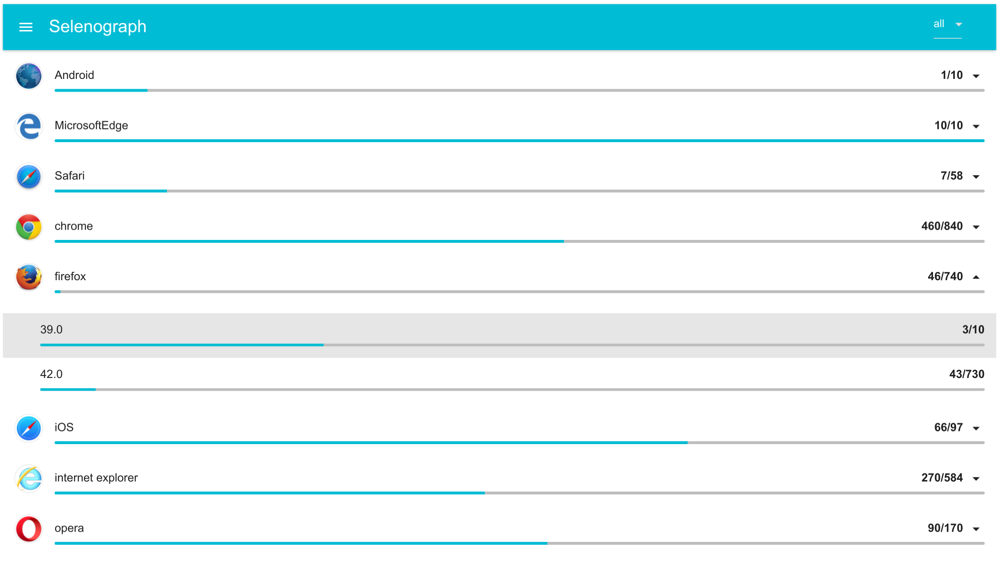

# Selenograph

**Selenograph** is a powered version of [Selenium Grid Router](https://github.com/seleniumkit/gridrouter) 
providing more information about currently running Selenium sessions and hubs state.



## Requirements

Unlike the original Grid Router, Selenograph has the shared state between nodes, which is stored in database.
We use [MongoDB](https://www.mongodb.org/) as a database, because it provides high availability, fault tolerance and schema-less approach.
Although it's recommended to use a replica set (at least 3 nodes of MongoDB), you can run just a single instance to play with Selenograph.

## Features

* Web interface displaying all available quotas, browsers and versions with the corresponding number of currently running sessions
* REST API showing information about currently running sessions for each quota and hub
* Ability to export to Graphite e.g. in order to visualize quotas and browsers usage statistics

## Installation

For Ubuntu users we provide deb packages. Please note that yandex-selenograph package conflicts with 
yandex-grid-router, so if you have previously installed Selenium Grid Router, you'll need to uninstall it first.
```
$ sudo add-apt-repository ppa:yandex-qatools/gridrouter
$ sudo apt-get update
$ sudo apt-get install yandex-selenograph
$ sudo service yandex-selenograph start
```

You can also run Selenograph in Docker container (not yet available - coming soon):

```
$ sudo docker run --net host \ 
                --log-opt max-size=1g \
                --log-opt max-file=2 \
                -v /etc/grid-router:/etc/grid-router:ro \
                -v /var/log/grid-router:/var/log/grid-router \
                -d qatools/selenograph:latest 
```

## Configuration

Most of configuration options duplicate the original [Selenium Grid Router](https://github.com/seleniumkit/gridrouter#configuration) ones.
To configure the MongoDB connection and other Selenograph-specific options, you should edit `/etc/grid-router/selenograph.properties`:

```
##### Main MongoDB options:  #####
# Specifies the mongodb hosts
camelot.mongodb.replicaset=localhost:27017

# Set the database name for selenograph
camelot.mongodb.dbname=selenograph

# Set the username for selenograph user
camelot.mongodb.username=

# Set the password for selenograph user
camelot.mongodb.password=


##### Graphite export options:  #####
# Specifies the graphite api host (uncomment to enable)
# graphite.host=127.0.0.1

# Specifies the graphite api port
# graphite.port=42000

# Specifies the prefix for metrics
# selenograph.gridrouter.graphite.prefix=selenograph


##### Advanced MongoDB options:  #####
# The following options are not recommended to change
# Edit them at your own risk only if you want to configure the connection options
# camelot.mongodb.connections.per.host=30
# camelot.mongodb.threads.connection.mult=40
# camelot.mongodb.connect.timeout=15000
# camelot.mongodb.heartbeat.timeout=15000
# camelot.mongodb.heartbeat.frequency=1000
# camelot.mongodb.heartbeat.socket.timeout=10000
# camelot.mongodb.readpreference=PRIMARY_PREFERRED
# camelot.mongodb.socket.timeout=60000
# camelot.mongodb.waitForLockSec=120
# camelot.mongodb.lockPollMaxIntervalMs=7
```


## REST API

### /quota
Requires Basic HTTP authorization with quota credentials. 
Shows information about browsers available in current quota. Output example:
```
{  
   "firefox:33.0":135,
   "chrome:opera-28.0":10,
   "chrome:opera-29.0":10,
   "firefox:37.0":55,
   "firefox:36.0":30,
   "firefox:39.0":10,
   "firefox:38.0":110,
   "chrome:48.0":100,
   "chrome:43.0":10,
   "internet explorer:9":20,
   "chrome:42.0":130,
   "internet explorer:8":20,
   "chrome:45.0":20,
   "chrome:44.0":10,
   "chrome:opera-30.0":10,
   "MicrosoftEdge:12.1":10,
   "firefox:40.0":20,
   "internet explorer:11":20,
   "firefox:41.0":20,
   "iOS:7.1":2,
   "internet explorer:10":20,
   "chrome:yandex-browser":25,
   "chrome:41.0":55,
   "chrome:40.0":5,
   "iOS:8.4":2,
   "android:6.0":5,
   "opera:12.16":20
}
```
### /stats
Requires Basic HTTP authorization with quota credentials. 
Returns usage statistics for each browser version for quota. `max` and `avg` numbers displays the maximum and average
concurrent sessions during current minute. `raw` and `current` displays the currently running sessions count.
Output example: 
```
{  
   "selenium:firefox:36.0":{  
      "max":0,
      "avg":0,
      "raw":0,
      "current":0
   },
   "selenium:chrome:41.0":{  
      "max":0,
      "avg":0,
      "raw":0,
      "current":0
   },
   "selenium:firefox:37.0":{  
      "max":0,
      "avg":0,
      "raw":0,
      "current":0
   },
   "selenium:firefox:38.0":{  
      "max":0,
      "avg":0,
      "raw":0,
      "current":0
   }
}
```
### /ping
A ping API for load balancers. Returns 200 when service is functioning properly.

### /api/selenograph/strategy
Shows a list of all available hubs with percentage of free browsers (100% for completely free hub). 
This information is used while selecting the next hub to route the session to. Output example:
```
{  
   "lastUpdated":"Feb,26 12:39:13.061",
   "hubs":{  
      "firefox33-1.selenium.net:4445":100,
      "firefox33-2.selenium.net:4445":75,
      "firefox42-1.selenium.net:4445":50,
      "firefox42-2.selenium.net:4445":100,
      "chrome45-1.selenium.net:4444":80,
      "firefox38-1.selenium.net:4445":100,
   }
}
```
### /api/selenograph/quotas
Shows information about all available quotas: which browser versions exist and how many browsers are available for each version.
This info is actually the mirror of the configured Gridrouter quotas enriched with currently running sessions count.
```
{  
   "all":[  
      {  
         "versions":[  
            {  
               "version":"33.0",
               "running":211,
               "max":500
            }
         ],
         "name":"firefox",
         "running":211,
         "max":500
      },
      {  
         "versions":[  
            {  
               "version":"11.0",
               "running": 280,
               "max": 584,
               "occupied":0
            },
         ],
         "name":"internet explorer",
         "running":0,
         "max":584,
         "occupied":0
      },
   ],
   "nick-ie11":[  
      {
         "versions":[  
            {  
               "version":"11.0",
               "running": 280,
               "max": 584
            },
         ],
         "name":"internet explorer",
         "running":0,
         "max": 584
      },
   ],
   "john-firefox":[  
      {
         "versions":[  
            {  
               "version":"33.0",
               "running": 211,
               "max": 500
            },
         ],
         "name":"firefox",
         "running":211,
         "max": 500
      },
   ]
}
```

### /api/selenograph/hubs
Shows which browser versions are available on each hub host and also how many sessions are running per hub and browser version.

```
[  
   {  
      "timestamp":1456480920001,
      "address":"firefox33-1.selenium.net:4444",
      "active":true,
      "max":5,
      "running":0,
      "browsers":[  
         {  
            "versions":[  
               {  
                  "version":"33.0",
                  "running":0,
                  "max":5
               }
            ],
            "name":"firefox",
            "running":0,
            "max":5
         }
      ]
   },
   // ...
]

```
